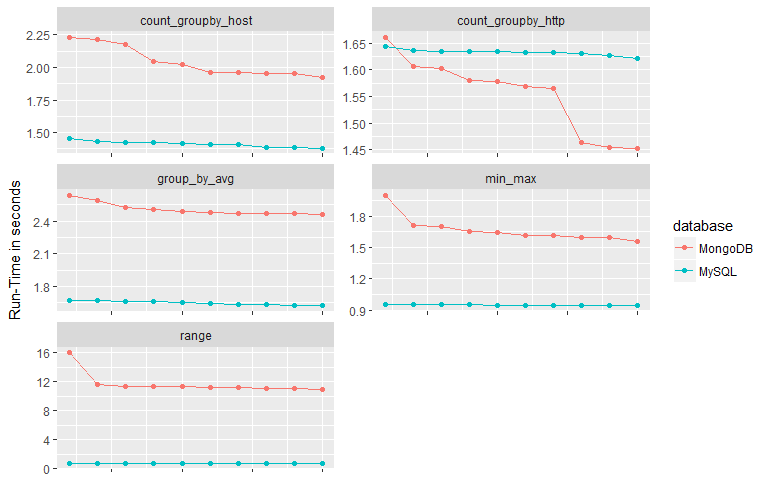

SQL vs NoSQL, Comparing the Performance of Popular Databases
================
Suhas Hegde
March 19, 2018

### Experiment setup and methodology

Only databases/data-stores that are compatible with both, the Linux environment and the Windows environment were selected for the experiment. Thus, popular NoSQL data-stores such as Redis and Cassandra were excluded from the initial experiment. MySQL, Elasticsearch and MongoDB were selected for the experiment.

#### Data -

The data selected for the experiment is an Apache-Weblog that contains traces for seven month's of HTTP requests made to the University of Saskatchewan's WWW server. This data is available [(here)](http://ita.ee.lbl.gov/html/contrib/Sask-HTTP.html) as an open source log-archive. The data-set contains one table with the following attributes,

-   host - String - The host that is making the request, either a host-name or the ip address.

-   timestamp - DateTime in the following format, "DAY MON DD HH:MM:SS YYYY"

-   request - String - The type of request being made to the server, such as "GET" or "PUT" etc.

-   HTTP\_reply - Integer - The reply code for the request, such as 200,404 etc.

-   reply\_size - Integer - Total number of bytes in a given reply

This data was selected because of its relative size (around 2.5 million rows) and the number of data types included in the data. It contains long Strings that are suitable for testing the performance of search operations. It also contains integers and dates that can be used for various other aggregations.

The first few rows of the data have been shown below in a table along with the information regarding the individual columns.

    ## # A tibble: 6 x 5
    ##   host         timestamp           request           HTTP_reply reply_size
    ##   <chr>        <dttm>              <chr>                  <int>      <int>
    ## 1 202.32.92.47 1995-06-01 06:00:59 GET /~scottp/pub~        200        271
    ## 2 ix-or7-27.i~ 1995-06-01 06:02:51 GET /~ladd/ostri~        200     205908
    ## 3 ram0.huji.a~ 1995-06-01 06:05:44 GET /~scottp/pub~        200        271
    ## 4 eagle40.sas~ 1995-06-01 06:08:06 GET /~lowey/             200       1116
    ## 5 eagle40.sas~ 1995-06-01 06:08:19 GET /~lowey/kevi~        200      49649
    ## 6 cdc8g5.cdc.~ 1995-06-01 06:11:03 GET /~friesend/t~        200        461

------------------------------------------------------------------------

#### Programming Language and The interfaces -

[R-language](https://www.r-project.org/) was used as the chosen programming language for the implementation of the experiment. The main reasons include, easy ability to perform data analysis, familiarity of the author with R (more than 6 years of experience), availability of easy and consistent interfaces to access various SQL and NoSQL databases etc. Interfacing databases using a programming language does add some amount of overhead while executing a query but this has been ignored on the basis that all the databases used for the experiment would have similar amounts of overhead added to their performance and hence relatively speaking we can ignore the effect of the overhead. The interfaces (clients) chosen include, [DBI](https://db.rstudio.com/dbi/)(MySQL), [elastic](https://github.com/ropensci/elastic)(Elasticsearch) and [mongolite](https://jeroen.github.io/mongolite/)(MongoDB). These clients were chosen based on the availability of full functionality as well as the stability and the maturity of the open-source projects themselves.

#### Experiment -

The experiment was conducted on a Windows 64 bit machine with 16GB of RAM and an Intel i-7 6700(Clock speed up-to 3.4GHz) processor. The methodology is as follows,

-   Each individual database/data-store was setup on the machine and the data was inserted into them separately.

-   Five queries that return the same data or result back were finalized for all of the data-stores

-   The queries were enclosed inside function calls in R

-   These function calls were made repeatedly(10 times each - Bench-marking) for each individual query and the run-times were measured and stored in a table

-   The selected queries either returned an aggregated result or a subset of the data. Across the board, the results were compared to make sure they were uniform.

-   Also, effort was made to make sure that queries were actually being fetched back into the R-environment and thus making sure that the run time included the time required to send the request and get back the result from the database/data-store. This is important since R has the mechanism of "lazy-loading" were certain results(such as calculations made in a Spark cluster) are not returned immediately, thus bringing down the amount of time required for that kind of calculation dramatically.

#### Example - Query and Function Calls

The code snippet below lists a query to aggregate all the results between two date ranges and count them. The same query has been implemented in all three databases and they have been enclosed in R-function calls.

    # date range query Elasticsearch
    elastic_range <- function(){
    date1 <- "1995-06-01 06:00:59"
    date2 <- "1995-11-15 11:59:59"

    mmatch <- '
    {
      "query" : {
        "bool" : {
          "must" : {
            "range" : {
              "timestamp" : {
                "gte" : "%s",
                "lte" : "%s",
                "format" : "yyyy-MM-dd HH:mm:ss"
              }
            }
          }
        }
      }
    }
    '
    sprintf(mmatch, date1, date2) -> mmatch
    Search(index = "weblog", body = mmatch)$hits$total}

    # range query between two given dates - MongoDB
    mongoDB_range <- function(){
    con$find(
    '{ "timestamp" : {
          "$gte" : {"$date" : "1995-06-01T06:00:59Z"},
          "$lte" : {"$date" : "1995-11-15T11:59:59Z"}
    }}'
    )}

    # range query between two given dates - MySQL
    mysql_range <- function(){
    dbSendQuery(con,
                "SELECT COUNT(timestamp)
                  FROM weblog
                  WHERE timestamp >= '1995-06-01 06:00:59' AND timestamp <= '1995-11-15 11:59:59'")-> s 
    dbFetch(s)
    dbClearResult(s)}

------------------------------------------------------------------------

Results and Analysis
--------------------

The results contain information regarding the query and the run-time for each individual instance of a query. The following three visualizations look run-times for different queries for each type of database. One of the things to note here is that as the same query is performed for a second time the run-time decreases drastically. This can be attributed to the fact that all three databases cache their results and when the same result is requested from the client, they are returned faster thus saving time.

------------------------------------------------------------------------

If we visualize time taken to execute the queries as box-plots for individual databases, we can look at the distributions and then determine if there is any significant difference between them.

As we can see from the above graph, there seems to be significant difference between Elasticsearch and MySQL. The y-axis has been converted into a log-scale in-order to accommodate the whole range of data. It looks like MongoDB and MySQL have similar Mean run-times but some queries take a lot longer in MySQL.

    ## # A tibble: 3 x 2
    ##   database      mean_run_time
    ##   <chr>                 <dbl>
    ## 1 Elasticsearch       0.00916
    ## 2 MongoDB             4.42   
    ## 3 MySQL              25.1

We need not run any statistical tests to determine that there is significant difference between Elasticseacrh and MySQL, but running one by excluding outliers would give us a definitive answer. Let us look at the type of queries that take the most amount of time in MySQL.

    ## # A tibble: 5 x 2
    ##   query_type         maximum
    ##   <chr>                <dbl>
    ## 1 group_by_avg         81.0 
    ## 2 count_groupby_host   53.5 
    ## 3 count_groupby_http    1.95
    ## 4 range                 1.60
    ## 5 min_max               1.46

The queries where a group by operation is performed on a column with text data seems to take a lot more time than any other type of query. Let us look at the mean run-time after excluding this type of queries.

    ## # A tibble: 3 x 2
    ##   database      mean_run_time
    ##   <chr>                 <dbl>
    ## 1 Elasticsearch       0.00916
    ## 2 MongoDB             4.42   
    ## 3 MySQL               1.51

The performance is being hindered by the group\_by and search operations on text columns in MySQL.

------------------------------------------------------------------------

#### Statistical Tests

Let us perform a Wilcox-test(also called Mann-Whitney-U test) to determine if there is significant difference between the performance given by Elasticsearch and the other two. We are using this statistical test instead of the traditional t-test since the run-time samples are not independent in nature. The second and the rest of the samples taken for a query have a performance gain due to caching of results. To counter for this non-normality we are using a test that does not require its data to be from a "normal-distribution"

    ## 
    ##  Wilcoxon rank sum test with continuity correction
    ## 
    ## data:  test_data$Elasticsearch$time and test_data$MySQL$time
    ## W = 0, p-value = 4.717e-14
    ## alternative hypothesis: true location shift is less than 0

The above result gives a lot of output that might be hard gauge at first, but we need to concentrate mainly on two metrics, "alternative hypothesis" and the "p-value". Our null hypothesis is that the median run-time between the groups(two databases) is equal, here it is indicating that we need to reject that hypothesis. Thus we can assuredly claim that at least for the given type of queries Elasticseacrh performs remarkably better than a MySQL database even when we exclude the type of queries MySQL is bad at. We can safely say so since the "p-value" - probability of getting the results the other way is very small.

One of the main reasons for the better performance in case of Elasticsearch is that it automatically creates indexes for every column(called "fields" in Elasticsearch terms) in the data. For text data it creates indexes based on what is known as a "tf-idf" score. tf-idf(term frequency multiplied by inverse document frequency) is a concept derived from natural language processing that helps in promoting rare words compared to commonly occurring stop words such as "for, the" etc in the English language. We can see if it is possible to mitigate these effects by creating indexes for a MySQL database.

------------------------------------------------------------------------

#### Effect of the "Index"

Both MongoDB and MySQL do not auto create indexes for all the columns/fields. So let us see if creating indexes has any effect on the timings.

    # adding multiple indexes to a mongoDB collection
    con$index(add = '{"host": 1, "timestamp": 1,"request": 1,"HTTP_reply": 1,"reply_size": 1}')

    # adding indexes to a MySQL table
    "CREATE INDEX time_ind
      ON weblog (timestamp)"

    "CREATE INDEX multi_ind
      ON weblog (host,reply_size)"

Let us look at the mean run times after adding the indexes.

    ## # A tibble: 2 x 2
    ##   database  mean
    ##   <chr>    <dbl>
    ## 1 MongoDB   3.90
    ## 2 MySQL     1.28

We were able to see a drastic reduction in terms run time for MySQL after adding the indexes. In fact, the reduction was almost by a factor of 20 when compared to the earlier mean run time which was 25.1 seconds. MongoDB had a reduction too, but it wasn't that significant. It went down from 4.42 to 3.89 seconds. This might have to do with the fact that we created a multi-index. If we optimize the index we might see even more reduction in terms of run times. Now the run times for all three databases are comparable. Even after creating indexes it looks like Elasticsearch holds an advantage in-terms of performance over the other two, but it is not as huge as it was earlier.

The above two plots show the effect of indexes on MySQL very clearly. After adding the indexes the run-times have clearly gone down for all the queries, thus bringing down the mean value. Even the outliers, the queries that had group-by-aggregate clauses are being executed way faster than before. Let us conduct the Wilcox-test on this new data and see if the performance difference between Elasticsearch and MySQL still holds true.

    ## 
    ##  Wilcoxon rank sum test with continuity correction
    ## 
    ## data:  elasticsearch$time and mysql$time
    ## W = 0, p-value < 2.2e-16
    ## alternative hypothesis: true location shift is less than 0

By observing the p.value we can conclude that Elasticsearch is still significantly better than using MySQL for aggregations.

------------------------------------------------------------------------

### Conclusions and Caveats

The following points can be made with certain degree of assuredness after analyzing the results,

-   Using Elasticseacrh for search and aggregation seems to have some merit in it.

-   If we carefully add Indexes we can drastically increase the performance of a database.

The experiment is flawed in some ways,

-   It only looks at the time required to execute a query, it does not pay attention to the memory load and space efficiency on the server.

-   Elasticseacrh is good only for searching and aggregations, when it comes to returning a large subset of the data it performs very poorly. By default it cannot return more than 10000 documents at once and workarounds such as "paging" need to be used to get bigger results back. These type of queries have been intentionally left out.

-   Cost of uploading and updating data hasn't been looked at. By observation and experience it seems Elasticseacrh needs a lot more resources to upload large amounts of data to the data-store.

-   The data-set contains only one table and it is convenient to store it in a NoSQL datastore. If there are multiple tables, theses datastores might not perform as intended since they lack capabilities such as join operations etc.

------------------------------------------------------------------------

#### References

-   [Performance evaluation of NoSQL databases](https://pdfs.semanticscholar.org/1a36/55dfb31c4bc33a3a3e7cf78dac2efa9c8ca6.pdf), A. Gandini, M. Gribaudo, W. J. Knottenbelt, R. Osman, P. Piazzolla, Imperial College London and Politecnico di Milano

-   [Empirical Analysis on Comparing the Performance of Alpha Miner Algorithm in SQL Query Language and NoSQL Column-Oriented Databases Using Apache Phoenix](https://arxiv.org/pdf/1703.05481.pdf), Kunal Gupta, Astha Sachdev, Ashish Sureka, IIIT Delhi, India

-   [Benchmarking Top NoSQL Databases](https://www.datastax.com/wp-content/themes/datastax-2014-08/files/NoSQL_Benchmarks_EndPoint.pdf), End Point Corporation

-   [A Comparison Of NoSQL Database Systems: A Study On MongoDB, Apache Hbase, And Apache Cassandra](https://www.researchgate.net/publication/321622083_A_Comparison_of_NoSQL_Database_Systems_A_Study_on_MongoDB_Apache_Hbase_and_Apache_Cassandra), Ali Hammood, Murat Saran, Çankaya University, Turkey

-   [MongoDB official documentation](https://docs.mongodb.com/)

-   [Mongolite - R interface to MongoDB, Jeroen Ooms 2017](https://jeroen.github.io/mongolite/index.html#install-mongolite-in-r)

-   [elastic - Elasticsearch for R, Scott Chamberlain 2017](https://ropensci.org/technotes/2017/08/02/elasticsearch-client/)

-   [Elasticsearch Official Reference](https://www.elastic.co/guide/en/elasticsearch/reference/current/index.html)

-   [Elasticsearch: The Definitive Guide, Clinton Gormley, Zachary Tong 2014, 2015 Elasticsearch](https://www.elastic.co/guide/en/elasticsearch/guide/current/index.html)

-   [MySQL Documentation](https://dev.mysql.com/doc/)

-   [Stack-overflow questions](https://stackoverflow.com/)

##### R-packages

-   R Core Team (2017). R: A language and environment for statistical computing. R Foundation for Statistical Computing, Vienna, Austria. URL <https://www.R-project.org/>.

-   Hadley Wickham (2017). tidyverse: Easily Install and Load the 'Tidyverse'. R package version 1.2.1. <https://CRAN.R-project.org/package=tidyverse>

-   Scott Chamberlain (2017). elastic: General Purpose Interface to 'Elasticsearch'. R package version 0.8.0. <https://CRAN.R-project.org/package=elastic>

-   Garrett Grolemund, Hadley Wickham (2011). Dates and Times Made Easy with lubridate. Journal of Statistical Software, 40(3), 1-25. URL <http://www.jstatsoft.org/v40/i03/>.

-   Jeroen Ooms (2014). The jsonlite Package: A Practical and Consistent Mapping Between JSON Data and R Objects. arXiv:1403.2805 \[stat.CO\] <http://arxiv.org/abs/1403.2805>

-   Jeroen Ooms (2014). The jsonlite Package: A Practical and Consistent Mapping Between JSON Data and R Objects. arXiv:1403.2805 \[stat.CO\] URL <https://arxiv.org/abs/1403.2805>.

-   Jeroen Ooms, David James, Saikat DebRoy, Hadley Wickham and Jeffrey Horner (2018). RMySQL: Database Interface and 'MySQL' Driver for R. R package version 0.10.14. <https://CRAN.R-project.org/package=RMySQL>

-   Olaf Mersmann (2018). microbenchmark: Accurate Timing Functions. R package version 1.4-4. <https://CRAN.R-project.org/package=microbenchmark>

------------------------------------------------------------------------
